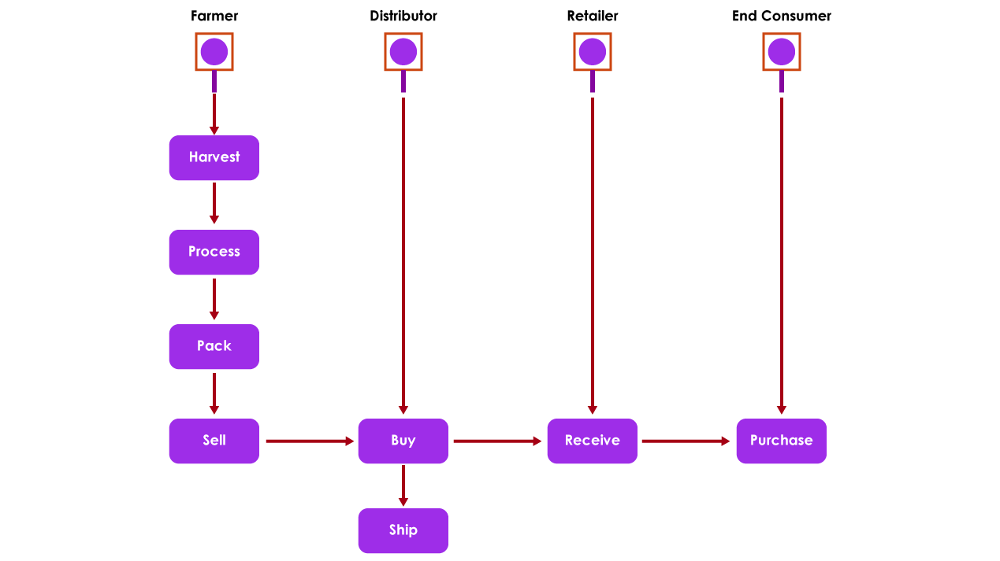
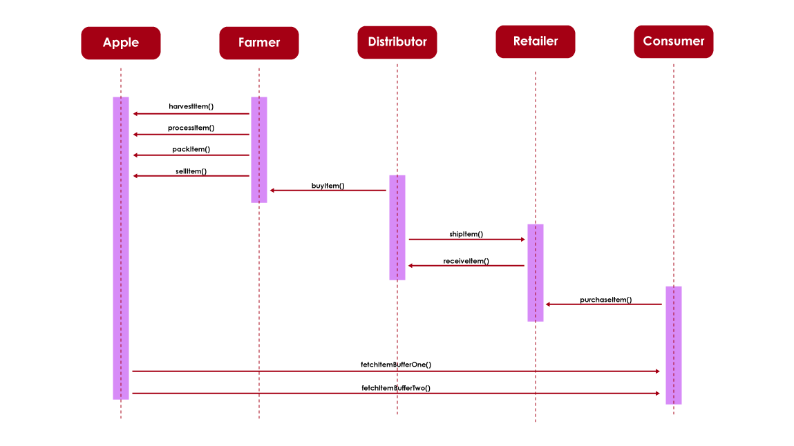
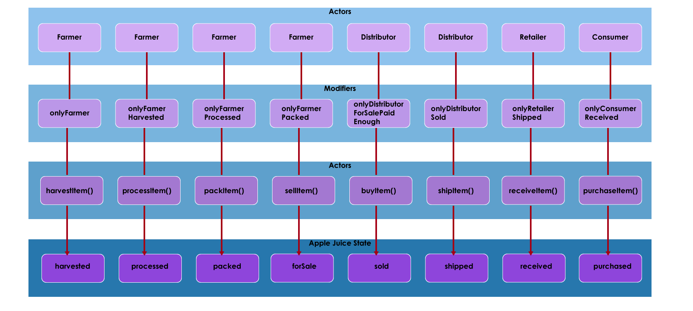
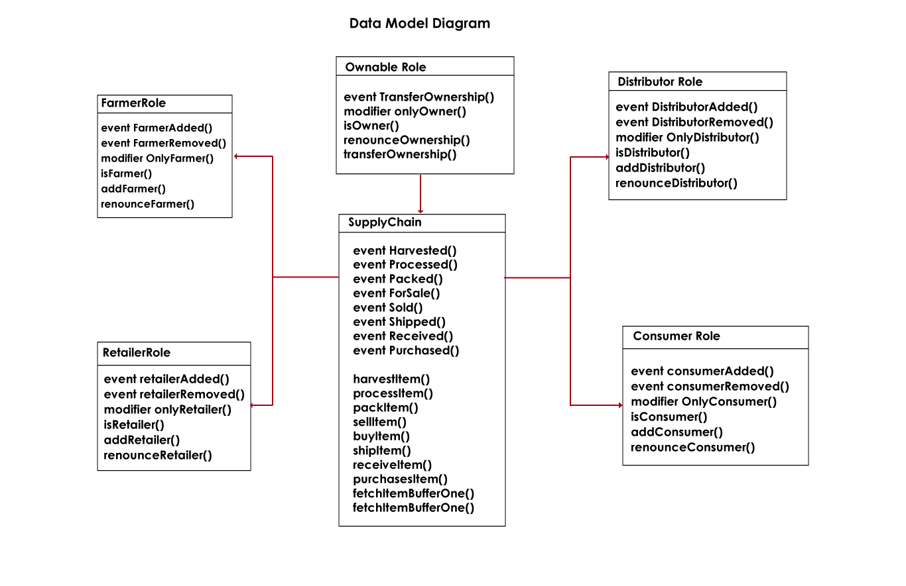

# Decentralized Supply Chain Architecture For Apple Juice Product

An MVP for a supply chain architecture using technologies like Ethereum and IPFS. The goals are to manage the ensure easy tracking and verification of a product's authenticity.

## Project write-up - UML

### Activity Model Diagram

### Sequence Model Diagram

### State Model Diagram

### Data Model Diagram

Run the Client Application:
`npm run dev`
